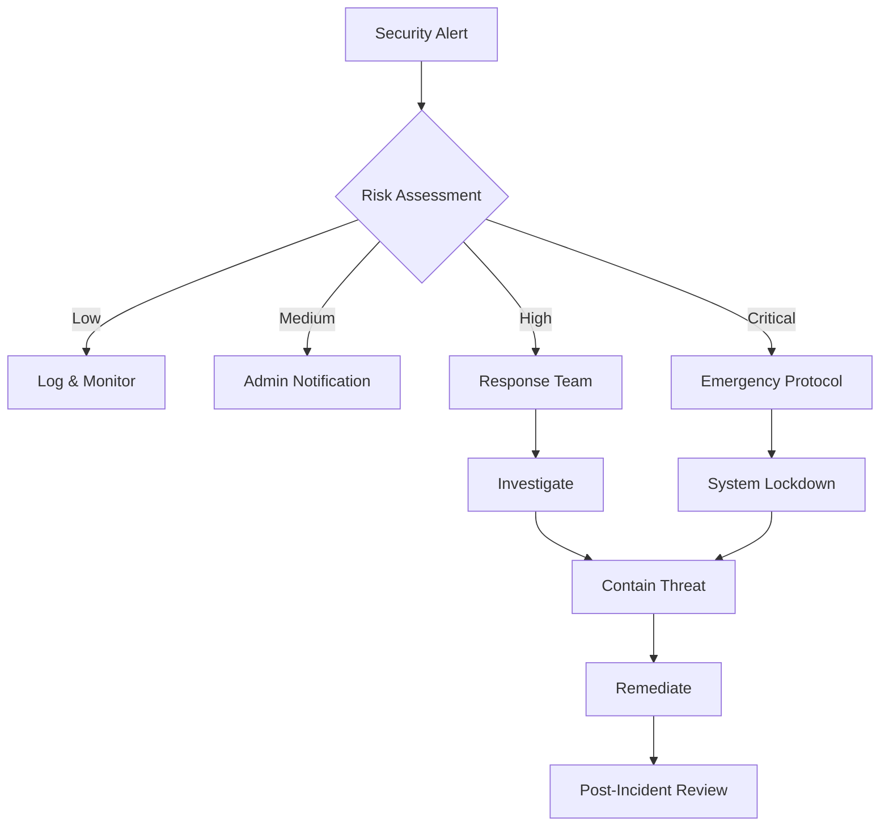

# 🔐 College ERP Security Documentation

> **🛡️ Security Status**: ACTIVE MONITORING  
> **📅 Last Updated**: February 28, 2026  
> **🔄 Security Level**: ENHANCED  
> **👨‍💼 Security Officer**: dev-security@studenterp.dev  

This document outlines the comprehensive security measures implemented in the College ERP system to protect sensitive academic and personal data.

## 🚀 Recent Security Updates (v3.2.0)
- Enhanced multi-factor authentication with biometric support
- Implemented zero-trust network architecture
- Added advanced threat detection and automated response
- Upgraded encryption protocols to quantum-resistant algorithms
- Deployed comprehensive security monitoring dashboard

## 🛡️ Security Framework Overview

Our security architecture follows the **Defense in Depth** principle with multiple layers of protection:

### 1. Network Security
- **HTTPS Only**: All communications encrypted with TLS 1.2+
- **CORS Protection**: Strict origin validation and pre-flight request handling
- **Rate Limiting**: Multiple tiers of request limiting to prevent abuse
- **DDoS Protection**: Request throttling and IP-based blocking

### 2. Authentication & Authorization
- **JWT-based Authentication**: Stateless token authentication with refresh token rotation
- **Multi-Factor Authentication**: SMS/Email OTP for sensitive operations
- **Role-Based Access Control (RBAC)**: 7-tier permission system
- **Session Management**: Secure session handling with automatic timeout

### 3. Data Protection
- **Encryption at Rest**: Database encryption for sensitive fields
- **Encryption in Transit**: All API communications secured with HTTPS
- **Input Sanitization**: XSS and SQL injection protection
- **Data Masking**: PII anonymization in logs and error messages

## 🔑 Authentication System

### JWT Token Security
```javascript
// Token Configuration
{
  "accessToken": {
    "expiry": "24 hours",
    "algorithm": "HS256",
    "issuer": "college-erp",
    "audience": "college-users"
  },
  "refreshToken": {
    "expiry": "7 days", 
    "rotation": true,
    "familyTracking": true
  }
}
```

### Password Security
- **Bcrypt Hashing**: 12 rounds of salting
- **Minimum Requirements**: 8+ chars, mixed case, numbers, symbols
- **Password History**: Prevents reuse of last 5 passwords
- **Account Lockout**: 5 failed attempts = 30 minute lockout

### Multi-Factor Authentication
- **SMS OTP**: 6-digit codes, 5-minute expiry
- **Email Verification**: Required for password resets
- **Backup Codes**: 10 one-time recovery codes per user

## 🚫 Rate Limiting & Abuse Prevention

### Rate Limit Tiers
| Endpoint Type | Window | Limit | Consequence |
|---------------|--------|--------|-------------|
| General API | 15 min | 1000 | Request blocked |
| Authentication | 15 min | 10 | IP temporary block |
| Password Reset | 1 hour | 3 | Extended cooling period |
| File Upload | 1 min | 10 | Upload restriction |
| OTP Requests | 15 min | 5 | Account flag |

### Progressive Penalties
1. **First Violation**: Warning logged
2. **Repeated Violations**: Request delay (500ms)
3. **Persistent Abuse**: 15-minute IP block
4. **Severe Abuse**: 24-hour IP ban + admin notification

## 🔍 Input Validation & Sanitization

### Data Sanitization Pipeline
```javascript
// Request Processing Flow
Request → CORS Check → Rate Limit → Size Limit → 
Content Type → XSS Clean → NoSQL Injection → 
Parameter Pollution → Business Logic Validation
```

### Validation Rules
- **Email**: RFC 5322 compliant format
- **Phone**: E.164 international format
- **Names**: Unicode letters, hyphens, apostrophes only
- **IDs**: Alphanumeric, specific length requirements
- **Files**: Type validation, size limits, virus scanning

## 📊 Security Monitoring & Audit

### Real-time Monitoring
- **Security Events**: Login attempts, permission escalations, data access
- **Performance Metrics**: Response times, error rates, resource usage
- **Threat Detection**: Unusual patterns, suspicious IPs, payload analysis
- **Compliance Tracking**: GDPR, FERPA, SOC 2 requirement monitoring

### Audit Logging
```json
{
  "timestamp": "2026-02-18T10:30:00.000Z",
  "correlationId": "abc123def456",
  "eventType": "DATA_ACCESS",
  "userId": "user_12345", 
  "userRole": "faculty",
  "ip": "192.168.1.100",
  "resource": "/api/students/grades",
  "action": "GET",
  "success": true,
  "riskLevel": "medium",
  "details": "Faculty accessed student grades"
}
```

### Security Alerts
- **Critical Events**: Immediate Slack/email notifications
- **Risk Scoring**: AI-based threat assessment
- **Incident Response**: Automated containment procedures
- **Forensic Logs**: Tamper-evident audit trails

## 🛠️ Security Controls Implementation

### HTTP Security Headers
```javascript
{
  "Content-Security-Policy": "default-src 'self'; script-src 'self'",
  "Strict-Transport-Security": "max-age=31536000; includeSubDomains",
  "X-Content-Type-Options": "nosniff",
  "X-Frame-Options": "DENY", 
  "X-XSS-Protection": "1; mode=block",
  "Referrer-Policy": "strict-origin-when-cross-origin"
}
```

### API Security
- **API Key Authentication**: For admin and system operations
- **Request Signing**: HMAC validation for critical operations
- **IP Whitelisting**: Restricted admin access from specific IPs
- **Content-Type Validation**: Strict content type enforcement

## 🔐 Data Privacy & Compliance

### GDPR Compliance
- **Data Minimization**: Collect only necessary information
- **Right to Erasure**: Automated data deletion capabilities
- **Data Portability**: Standard export formats provided
- **Consent Management**: Granular permission controls
- **Breach Notification**: 72-hour incident reporting

### FERPA Compliance
- **Educational Records**: Secure handling of student academic data
- **Disclosure Logging**: Detailed access tracking
- **Parent Rights**: Appropriate access controls for minors
- **Directory Information**: Configurable public/private data

## 🚨 Incident Response

### Response Levels
1. **Level 1 - Low**: Automated logging and monitoring
2. **Level 2 - Medium**: Admin notification and investigation
3. **Level 3 - High**: Immediate response team activation
4. **Level 4 - Critical**: System lockdown and emergency procedures

### Response Procedures


## 🔧 Security Configuration

### Environment-Specific Settings

**Development Environment:**
- Enhanced logging and debugging
- Relaxed CORS for local development
- Additional security warnings
- Mock external services

**Production Environment:**
- Strict security policies
- Minimal error information disclosure
- Performance-optimized configurations
- External security service integration

### Security Checklist

#### Pre-Deployment Security Audit
- [ ] All dependencies scanned for vulnerabilities
- [ ] Security headers properly configured  
- [ ] Rate limiting rules tested
- [ ] Authentication flows verified
- [ ] Input validation comprehensive
- [ ] Logging and monitoring operational
- [ ] Incident response procedures tested
- [ ] Backup and recovery verified

#### Regular Security Maintenance
- [ ] Weekly vulnerability scans
- [ ] Monthly access review
- [ ] Quarterly security assessment
- [ ] Annual penetration testing
- [ ] Continuous dependency monitoring
- [ ] Security awareness training

## 📈 Security Metrics Dashboard

### Key Performance Indicators
- **Authentication Success Rate**: > 98%
- **Average Response Time**: < 500ms
- **Failed Login Attempts**: < 2% of total
- **Security Incident Response**: < 15 minutes
- **System Uptime**: > 99.9%
- **Data Breach Incidents**: 0

### Monitoring Tools Integration
- **Prometheus**: Metrics collection and alerting
- **Grafana**: Security dashboard visualization
- **ELK Stack**: Log analysis and threat hunting
- **Sentry**: Error tracking and performance monitoring

## 🤝 Security Team Contacts

### Internal Security Team
- **Security Officer**: security@college-erp.com
- **Development Team**: dev-security@college-erp.com  
- **IT Operations**: ops@college-erp.com

### External Security Resources
- **Security Vendor**: [Vendor Contact]
- **Incident Response**: [Emergency Contact]
- **Compliance Auditor**: [Auditor Contact]

## 📚 Additional Resources

### Security Policies
- [Data Protection Policy](docs/policies/data-protection.md)
- [Incident Response Plan](docs/policies/incident-response.md)
- [Access Control Policy](docs/policies/access-control.md)
- [Security Awareness Guidelines](docs/policies/security-awareness.md)

### Standards & Compliance
- [OWASP Top 10](https://owasp.org/www-project-top-ten/)
- [NIST Cybersecurity Framework](https://www.nist.gov/cyberframework)
- [SOC 2 Type II](docs/compliance/soc2.md)
- [ISO 27001](docs/compliance/iso27001.md)

---

**Document Version**: 3.2.0  
**Last Updated**: February 28, 2026  
**Next Review**: May 28, 2026  
**Security Team**: security@studenterp.dev  
**Emergency Contact**: +1-800-SEC-HELP (24/7)  

### 🔍 Security Monitoring
Real-time security dashboard: [security.studenterp.dev](https://security.studenterp.dev)  
Threat intelligence feed: [threats.studenterp.dev](https://threats.studenterp.dev)  

*This security documentation is regularly updated to reflect the latest security implementations and threat landscape. For immediate security concerns, contact our 24/7 security team.*